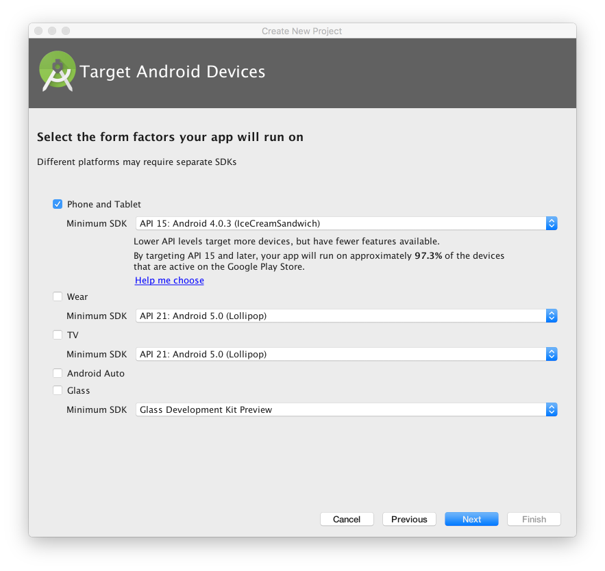
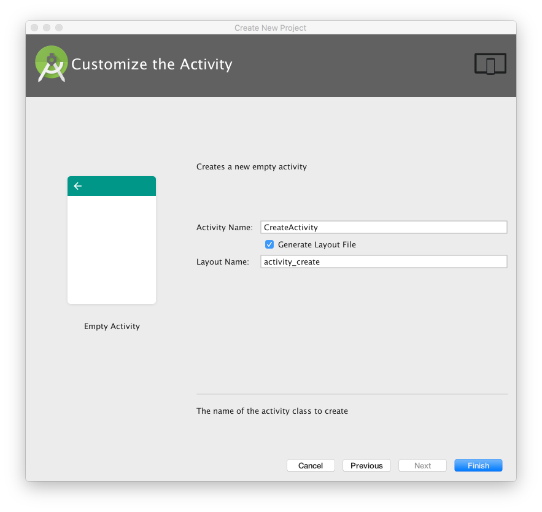
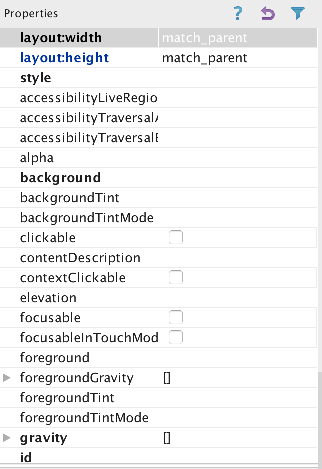

#Create Project

Download and install the latest Android/Ecliose SDL

Create a new Android application, with the following properties:

Note the 'Minimum Required SDK' which may be different from the default.

Accept all the defaults in the wizard - except the name of the main activity:

The project will look like this:

With the activity_donate open in the visual designer:

It is important to become familiar with the structure and purpose of the three panes surrounding the Donation 'canvas':

##Pallette:

##Outline

##Properties

These views are closely related - and you will need to monitor the information displayed there continually as you evolve the appearance of your activities screens.

