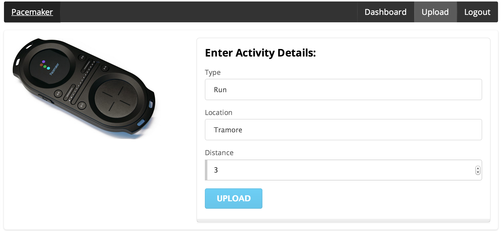

#Layout Donation Activity

For this lab, out objective is to reproduce in Android this feature from this web app:

In eclipse, delete the current 'Hello World' text, and drag and drop a new'LargeText' form widget onto the canvas. Look closely at the following:

Note carefully the following features:

- the guides tyeing the text to the left, top and right corner
- in Outline - the name of the control has been changed from a default to 'donateTitle'. This is changed by selecting the item in outline, and selecting 'Edit ID' from the context menu.
- in Properties - where we entered 'Welcome Homer' into the text field

Recreate the above precisely.

A 'Lint warning' will have popped up on the left:

and accept the offered id.

Locate the following two files and inspect them closely:

##res/layout/activity_create.xml

~~~xml
<?xml version="1.0" encoding="utf-8"?>
<RelativeLayout xmlns:android="http://schemas.android.com/apk/res/android"
    xmlns:tools="http://schemas.android.com/tools"
    android:layout_width="match_parent"
    android:layout_height="match_parent"
    android:paddingBottom="@dimen/activity_vertical_margin"
    android:paddingLeft="@dimen/activity_horizontal_margin"
    android:paddingRight="@dimen/activity_horizontal_margin"
    android:paddingTop="@dimen/activity_vertical_margin"
    tools:context="org.pacemaker.pacemaker.CreateActivity">

    <TextView
        android:layout_width="wrap_content"
        android:layout_height="wrap_content"
        android:textAppearance="?android:attr/textAppearanceLarge"
        android:text="@string/enter_activity_details"
        android:id="@+id/CreateActivityDetails"
        android:layout_alignParentTop="true"
        android:layout_alignParentLeft="true"
        android:layout_alignParentStart="true"
        android:layout_alignParentRight="true"
        android:layout_alignParentEnd="true" />
</RelativeLayout>
~~~

##res/values/strings.xml
~~~xml
<resources>
    <string name="app_name">Pacemaker</string>
    <string name="enter_activity_details">Enter Activity Details</string>
</resources>
~~~

Note the relationship between 'enter_activity_details' in both files. 

