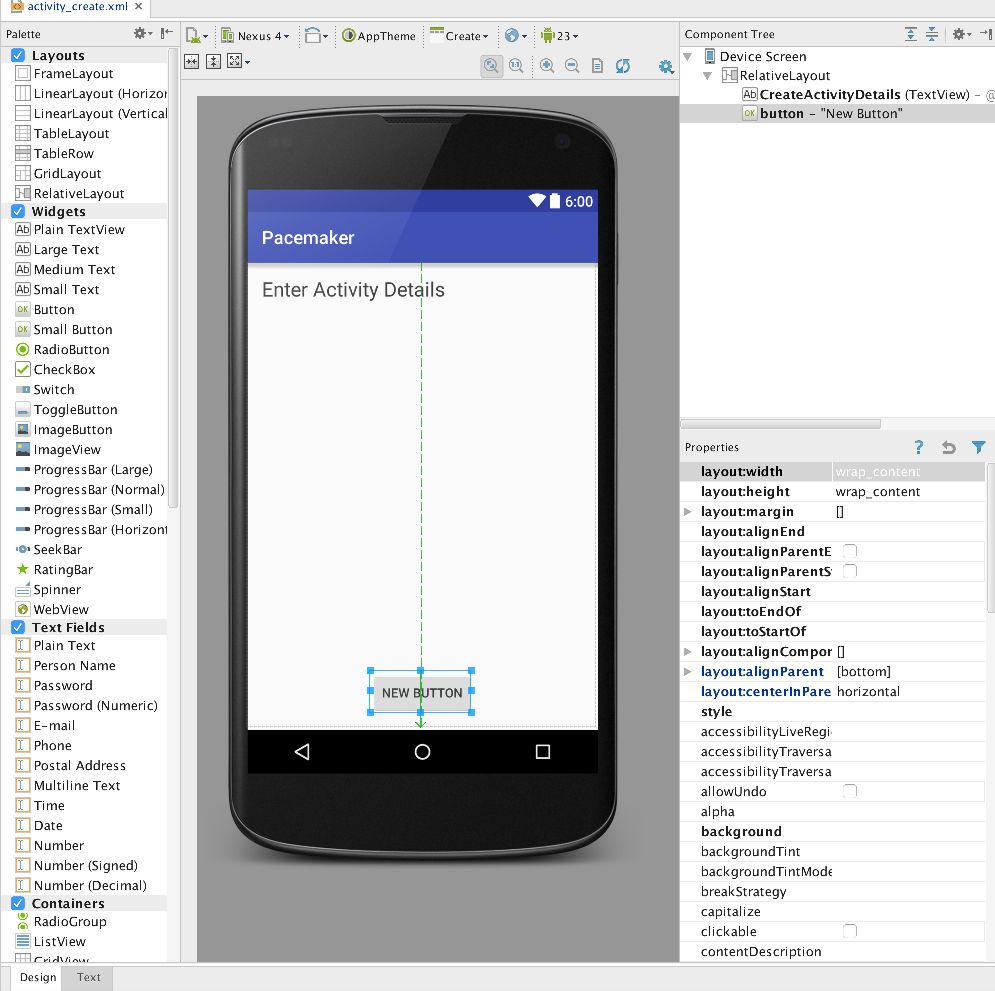
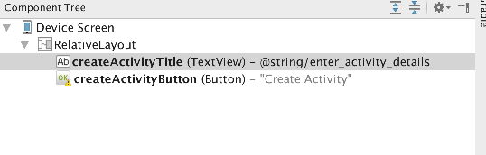
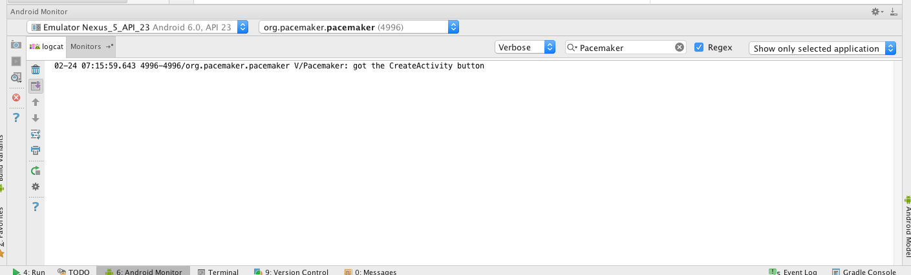

#Donate Button

Place a button directly on to the activity - attached to the bottom of the screen as shown:

Rename both the button and the text field:

You can do this by selecting the item in the outline view->Go To Declaration. Enter the more meaningful names in there.

The resource files will now be: 

###activity_create.xml 

~~~xml
<?xml version="1.0" encoding="utf-8"?>
<RelativeLayout xmlns:android="http://schemas.android.com/apk/res/android"
    xmlns:tools="http://schemas.android.com/tools"
    android:layout_width="match_parent"
    android:layout_height="match_parent"
    android:paddingBottom="@dimen/activity_vertical_margin"
    android:paddingLeft="@dimen/activity_horizontal_margin"
    android:paddingRight="@dimen/activity_horizontal_margin"
    android:paddingTop="@dimen/activity_vertical_margin"
    tools:context="org.pacemaker.pacemaker.CreateActivity">

    <TextView
        android:layout_width="wrap_content"
        android:layout_height="wrap_content"
        android:textAppearance="?android:attr/textAppearanceLarge"
        android:text="@string/enter_activity_details"
        android:id="@+id/createActivityTitle"
        android:layout_alignParentTop="true"
        android:layout_alignParentLeft="true"
        android:layout_alignParentStart="true"
        android:layout_alignParentRight="true"
        android:layout_alignParentEnd="true" />

    <Button
        android:layout_width="wrap_content"
        android:layout_height="wrap_content"
        android:text="Create Activity"
        android:id="@+id/createActivityButton"
        android:layout_alignParentBottom="true"
        android:layout_centerHorizontal="true" />
</RelativeLayout>

~~~

##strings.xml

~~~xml
<resources>
    <string name="app_name">Pacemaker</string>
    <string name="enter_activity_details">Enter Activity Details</string>
</resources>

~~~

If there is a deviation from the above - retrace your steps (delete the button) until you can match the above.

We can now switch our attention to the Java Activity class CreateActivity

~~~java
package org.pacemaker.pacemaker;

import android.support.v7.app.AppCompatActivity;
import android.os.Bundle;

public class CreateActivity extends AppCompatActivity
{

  @Override
  protected void onCreate(Bundle savedInstanceState)
  {
    super.onCreate(savedInstanceState);
    setContentView(R.layout.activity_create);
  }
}
~~~

For any 'controls' a user can interact with we usually find it useful to associate a class member with that object. Currently we have one only on - a Button. The text fields we dont consider 'interactive' as such, so we will not include those.

Insert the following new field into the class:

~~~java
  private Button createActivityButton;
~~~

The class will have to be imported. The class name will always match the name in the Palette:

We are free to call the variable anything we like. However, in order to keep confusion to a minimum, always call the variable by the same name you used in the Component Tree view:

In onCreate - we need to initialise this variable:

~~~java
    createActivityButton = (Button) findViewById(R.id.createActivityButton);
~~~

We might also add a logging message so we can have some feedback as the app launches:

~~~
    Log.v("Pacemaker", "got the CreateActivity button");
~~~

This is the complete activity class:

~~~java
package org.pacemaker;

import android.os.Bundle;
import android.app.Activity;
import android.util.Log;
import android.view.Menu;
import android.widget.Button;

public class CreateActivity extends Activity
{
  private Button createActivityButton;
  
  @Override
  protected void onCreate(Bundle savedInstanceState)
  {
    super.onCreate(savedInstanceState);
    setContentView(R.layout.activity_create);
    
    createActivityButton = (Button) findViewById(R.id.createActivityButton);
    
    Log.v("Pacemaker", "got the CreateActivity button");
  }

  @Override
  public boolean onCreateOptionsMenu(Menu menu)
  {
    // Inflate the menu; this adds items to the action bar if it is present.
    getMenuInflater().inflate(R.menu.create, menu);
    return true;
  }
}
~~~

Finding the log message can be difficult, unless you set a filter or just a simple search for the Pacemaker string:

