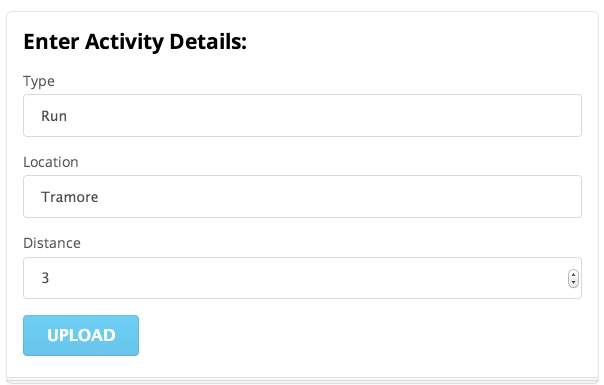
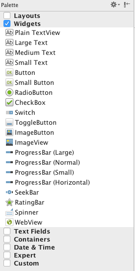
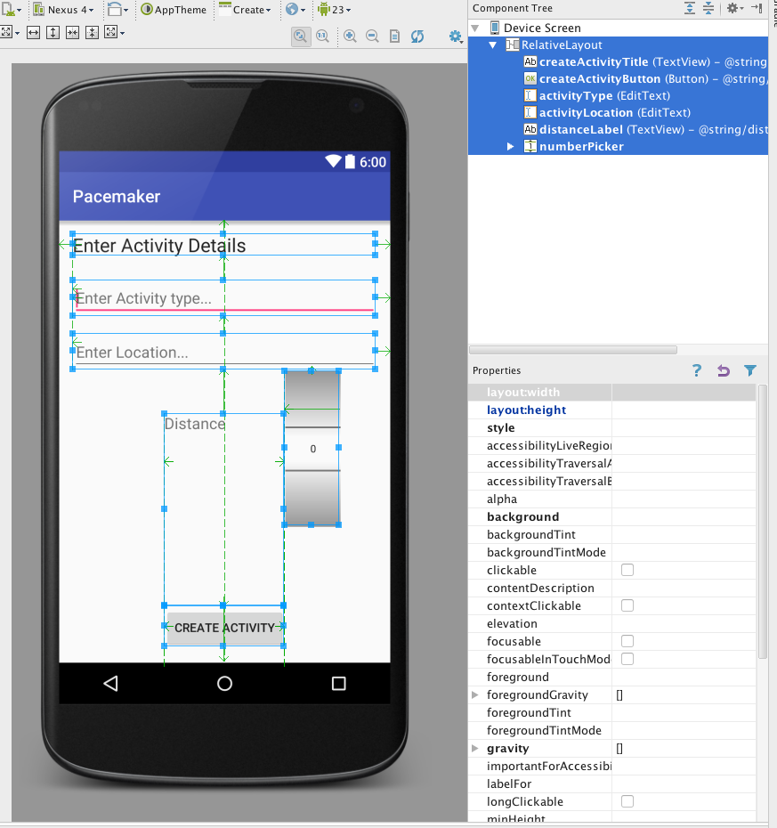

#Research + New Control Layout

Recall the UI we are trying to implement:

We need a Radio Buttons, some sort of selection/combo box + a progress bar. These can be found in various locations in the pallette:

RadioGroup, ProgressBar and NumberPicker seem likely candidates. The names of these controls are exactly as advertised, and we can expect them to be in the 'widgets' package. To verify this, try importing them at the top of the activity class:

~~~java
import android.widget.NumberPicker;
import android.widget.TextView;
~~~

... and we can bring in three fields into the class:

~~~java
  private Button       createActivityButton;
  private TextView     activityType;
  private TextView     activityLocation;
  private NumberPicker distancePicker;
~~~

We can also open up three pages of documentation - which we can reverse engineer from the package/class names:

- <http://developer.android.com/reference/android/widget/RadioGroup.html>
- <http://developer.android.com/reference/android/widget/ProgressBar.html>
- <http://developer.android.com/reference/android/widget/NumberPicker.html>

Note this time we have gone to the Activity class before actually creating the controls. We should do this now - and remember to use the same names (for the IDs) as we create the controls.

Getting the layout +id names as shown above may take some practice. However, it is an essential skill to get on top of, even it it takes a lot of trial and error.

For reference purposes (try to do it your self), these are the relevant generated xml files:

~~~xml
<?xml version="1.0" encoding="utf-8"?>
<RelativeLayout xmlns:android="http://schemas.android.com/apk/res/android"
    xmlns:tools="http://schemas.android.com/tools"
    android:layout_width="match_parent"
    android:layout_height="match_parent"
    android:paddingBottom="@dimen/activity_vertical_margin"
    android:paddingLeft="@dimen/activity_horizontal_margin"
    android:paddingRight="@dimen/activity_horizontal_margin"
    android:paddingTop="@dimen/activity_vertical_margin"
    tools:context="org.pacemaker.pacemaker.CreateActivity">

    <TextView
        android:layout_width="wrap_content"
        android:layout_height="wrap_content"
        android:textAppearance="?android:attr/textAppearanceLarge"
        android:text="@string/enter_activity_details"
        android:id="@+id/createActivityTitle"
        android:layout_alignParentTop="true"
        android:layout_alignParentLeft="true"
        android:layout_alignParentStart="true"
        android:layout_alignParentRight="true"
        android:layout_alignParentEnd="true" />

    <Button
        android:layout_width="wrap_content"
        android:layout_height="wrap_content"
        android:text="@string/create_activity"
        android:id="@+id/createActivityButton"
        android:layout_alignParentBottom="true"
        android:layout_centerHorizontal="true"
        android:onClick="createActivityButtonPressed"/>

    <EditText
        android:id="@+id/activityType"
        android:layout_width="wrap_content"
        android:layout_height="wrap_content"
        android:layout_alignLeft="@+id/createActivityTitle"
        android:layout_alignParentRight="true"
        android:layout_below="@+id/createActivityTitle"
        android:layout_marginTop="27dp"
        android:ems="10"
        android:hint="@string/activityTypeHint" >

        <requestFocus />
    </EditText>

    <EditText
        android:id="@+id/activityLocation"
        android:layout_width="wrap_content"
        android:layout_height="wrap_content"
        android:layout_alignLeft="@+id/activityType"
        android:layout_alignParentRight="true"
        android:layout_below="@+id/activityType"
        android:layout_marginTop="20dp"
        android:ems="10"
        android:hint="@string/activityLocationHint" />

    <TextView
        android:id="@+id/distanceLabel"
        android:layout_width="wrap_content"
        android:layout_height="wrap_content"
        android:layout_marginTop="50dp"
        android:text="@string/distanceLabel"
        android:textAppearance="?android:attr/textAppearanceMedium"
        android:layout_below="@+id/activityLocation"
        android:layout_alignRight="@+id/createActivityButton"
        android:layout_alignEnd="@+id/createActivityButton"
        android:layout_above="@+id/createActivityButton"
        android:layout_alignLeft="@+id/createActivityButton"
        android:layout_alignStart="@+id/createActivityButton" />

    <NumberPicker
        android:layout_width="wrap_content"
        android:layout_height="wrap_content"
        android:id="@+id/numberPicker"
        android:layout_below="@+id/activityLocation"
        android:layout_toRightOf="@+id/createActivityButton"
        android:layout_toEndOf="@+id/createActivityButton" />

</RelativeLayout>
~~~

~~~xml
<resources>
    <string name="app_name">Pacemaker</string>
    <string name="enter_activity_details">Enter Activity Details</string>
    <string name="activityTypeHint">Enter Activity type...</string>
    <string name="activityLocationHint">Enter Location...</string>
    <string name="distanceLabel">Distance</string>
    <string name="create_activity">Create Activity</string>
</resources>
~~~

If we have our naming conventions right - then we can bind to these new controls in onCreate:

~~~java
    createActivityButton = (Button)       findViewById(R.id.createActivityButton);
    activityType         = (TextView)     findViewById(R.id.activityType);
    activityLocation     = (TextView)     findViewById(R.id.activityLocation);
    distancePicker       = (NumberPicker) findViewById(R.id.numberPicker);
~~~

This is the complete CreateActivity class:

~~~java
package org.pacemaker.pacemaker;

import android.support.v7.app.AppCompatActivity;
import android.os.Bundle;
import android.util.Log;
import android.view.View;
import android.widget.Button;
import android.widget.NumberPicker;
import android.widget.TextView;

public class CreateActivity extends AppCompatActivity
{
  private Button       createActivityButton;
  private TextView     activityType;
  private TextView     activityLocation;
  private NumberPicker distancePicker;

  @Override
  protected void onCreate(Bundle savedInstanceState)
  {
    super.onCreate(savedInstanceState);
    setContentView(R.layout.activity_create);

    createActivityButton = (Button)       findViewById(R.id.createActivityButton);
    activityType         = (TextView)     findViewById(R.id.activityType);
    activityLocation     = (TextView)     findViewById(R.id.activityLocation);
    distancePicker       = (NumberPicker) findViewById(R.id.numberPicker);

    Log.v("Pacemaker", "got the CreateActivity button");
  }

  public void createActivityButtonPressed (View view)
  {
    Log.v("Pacemaker", "CreateActivity Button Pressed!");
  }
}
~~~

