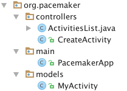

#Setup

This is the archive of the las lab:

 <https://github.com/wit-design-patterns-2016/pacemaker-android/releases/tag/V2>

The starting point for this lab is a small evolution on the last lab, can can be downloaded here:

 <https://github.com/wit-design-patterns-2016/pacemaker-android/releases/tag/V3>

This version has  a refactored package structure:

Also, the adapter is reconfigured to load a layout for each row:

