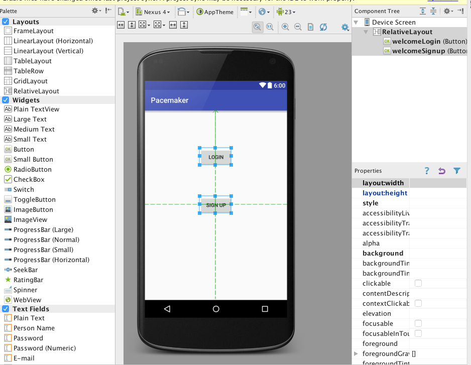

#Welcome View

Design a new activity to look like this:

You may end up with new entries in the strings.xml file:

##res/values/strings.xml

~~~
    <string name="welcomeLogin">Login</string>
    <string name="welcomeSignup">Sign up</string>
~~~

And this layout:

##res/layout/activity_welcome.xml

~~~xml
<?xml version="1.0" encoding="utf-8"?>
<RelativeLayout xmlns:android="http://schemas.android.com/apk/res/android"
    android:id="@+id/RelativeLayout"
    android:layout_width="match_parent"
    android:layout_height="match_parent"
    android:orientation="vertical" >

    <Button
        android:id="@+id/welcomeLogin"
        android:layout_width="wrap_content"
        android:layout_height="wrap_content"
        android:layout_alignParentTop="true"
        android:layout_centerHorizontal="true"
        android:layout_marginTop="102dp"
        android:onClick="loginPressed"
        android:text="@string/welcomeLogin" />

    <Button
        android:id="@+id/welcomeSignup"
        android:layout_width="wrap_content"
        android:layout_height="wrap_content"
        android:layout_centerHorizontal="true"
        android:layout_centerVertical="true"
        android:onClick="signupPressed"
        android:text="@string/welcomeSignup" />

</RelativeLayout>
~~~

