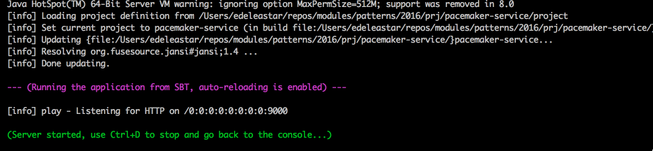

#Setup

##Android Pacemaker Client

This is v4 of the pacemaker-android project from the last android lab:

- <https://github.com/wit-design-patterns-2016/pacemaker-android/releases/tag/V4>

You can import this project, or keep working with your own version.

##Pacemaker Web Service

This is a version of the pacemaker-service from the Agile Software Module:

- <https://github.com/wit-design-patterns-2016/pacemaker-service>

This project was evolved over these labs:

- [Lab08](http://edeleastar.github.io/agile-software-dev/topic08/book/index.html)
- [Lab09](http://edeleastar.github.io/agile-software-dev/topic09/book/index.html)
- [Lab10](http://edeleastar.github.io/agile-software-dev/topic10/book/index.html)
- [Lab11](http://edeleastar.github.io/agile-software-dev/topic11/book/index.html)

To run the project, download and install the Play Framework Version 2.2.6:

- <https://www.playframework.com/download#older-versions>

Then download this release of pacemaker-service:

- <https://github.com/wit-design-patterns-2016/pacemaker-service/releases/tag/V2>

Run a shell inside the project folder and enter this command:

~~~
play run
~~~

The service should be available on:

- <http://localhost:9000>
