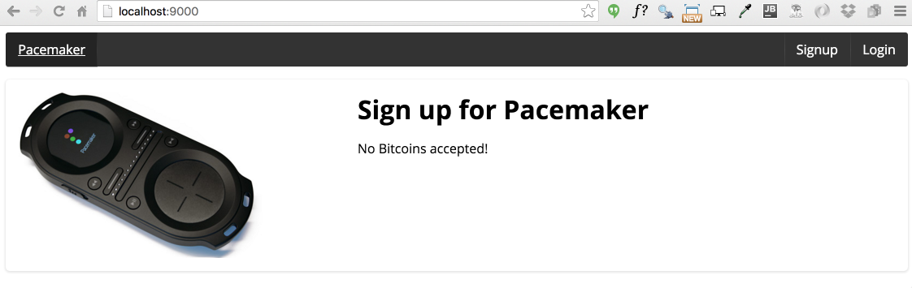
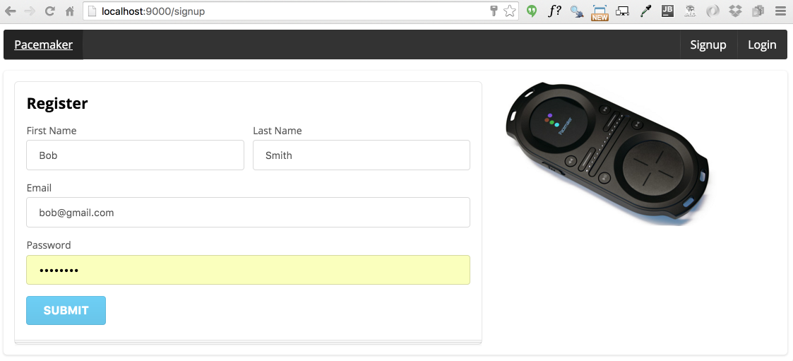
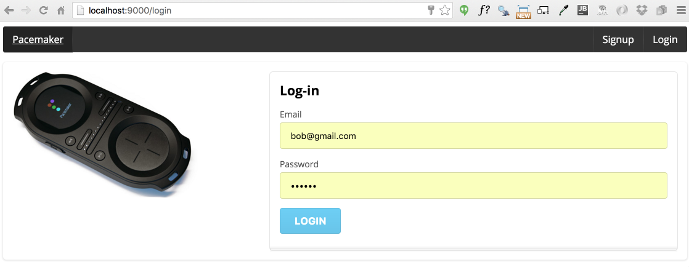
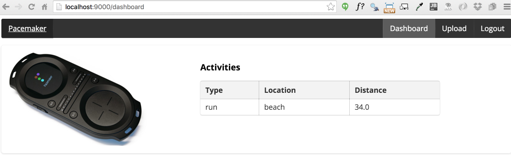
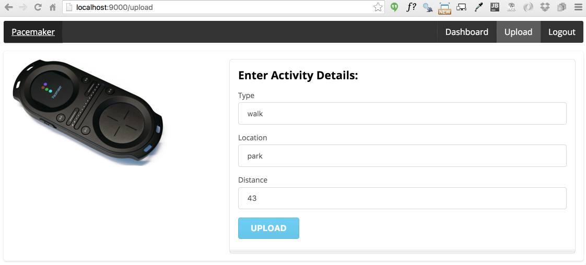
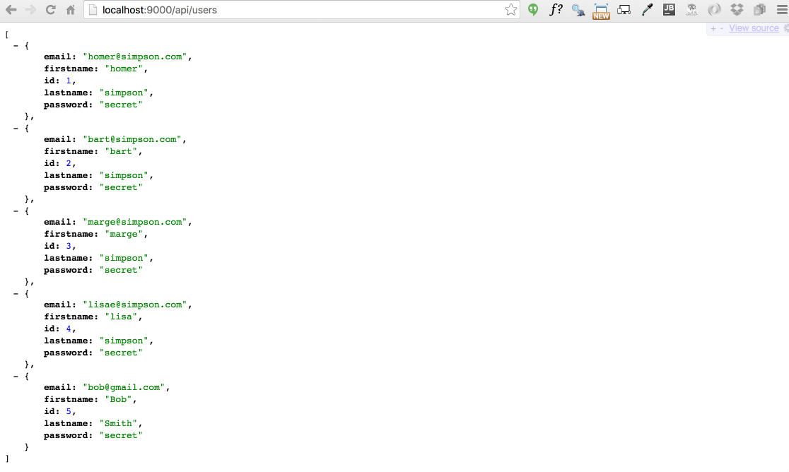
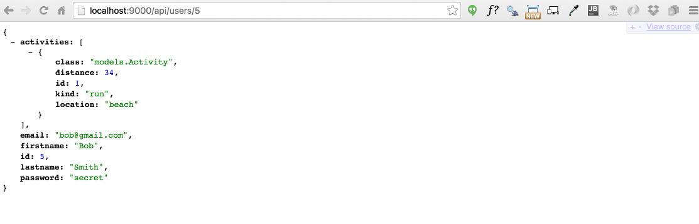
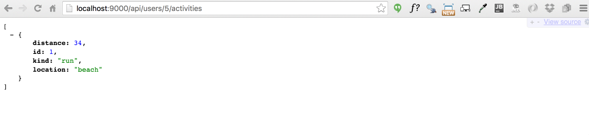

#Pacemaker-service

You can register a new user, log in and upload an activity.

- <http://localhost:9000>

The service also exposes REST endpoints:

- <http://localhost:9000/api/users>
- <http://localhost:9000/api/users/5>
- <http://localhost:9000/api/users/5/activities>

(this data is preloaded in the app).

