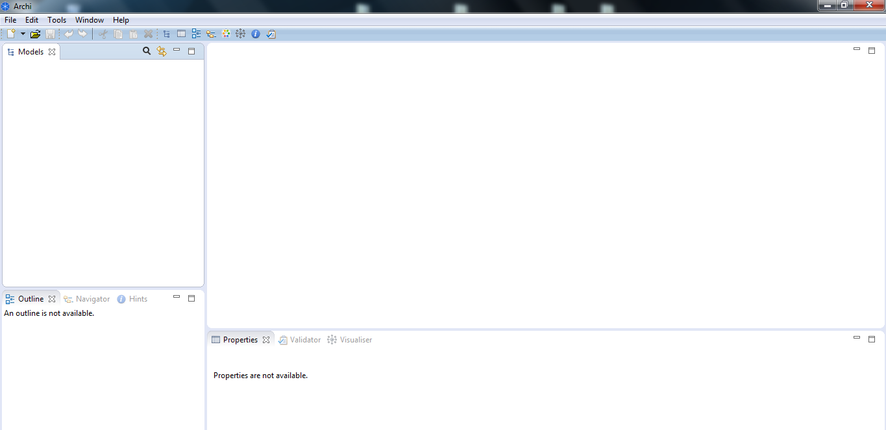

#Installing Archi (a tool for ArchiMate modelling)

You can read more about ArchiMate here: <http://pubs.opengroup.org/architecture/archimate2-doc/toc.html>

Nagivate to the ArchiMate website:

-  <http://www.archimatetool.com/>

and click the **Free Download** button to save the latest version to your local disk: 

Once it is downloaded, locate the file on your hard disk and run it.

Once installed, start the Archi application:

Close the **Welcome** window.  You are now ready to start modelling:

