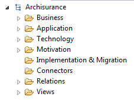

#Archisurance Example

Archi comes with two example Models:

- Archisurance (the focus of this lab)
- OpenDay

Open the **Archisurance** model that is stored in the **examples** folder for your recently installed **Archi** application:

The Model Tree for Archisurance looks like this:

***Note: when you create an empty model, you are provided with the highest-level folder structure. You can create sub-folders under these and this allows you to organise the elements in any way you wish.***  

The Archinsurance model contains elements that typically belong to one of three main layers at which an enterprise can be modelled:

- The Business Layer
- The Application Layer
- The Technology Layer

In the next few steps, we will briefly look at each of these three layers and the elements within.  We will also investigate some other folders in the Model Tree.

