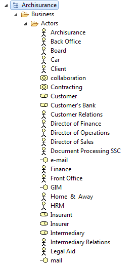
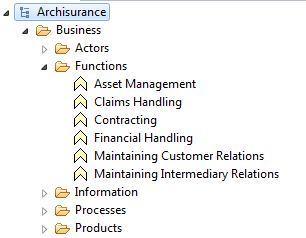

#Archinsurance Example - Business Layer

***According to opengroup.org, "the Business Layer offers products and services to external customers, which are realised in the organisation by business processes performed by business actors."***

##Business Layer - Legend of Possible Elements

##Actors (user-defined sub folder)

Referring to the legend of elements above, review the Actors created in the Archinsurance model:

##Functions (user-defined sub folder)

Referring to the legend of elements above, review the Functions created in the Archinsurance model:

##Information (user-defined sub folder)

Referring to the legend of elements above, review the Information elements created in the Archinsurance model:

##Processes (user-defined sub folder)

Referring to the legend of elements above, review the Processes created in the Archinsurance model:

##Products (user-defined sub folder)

Referring to the legend of elements above, review the Produts created in the Archinsurance model:

For more information on the Business Layer, please visit <http://pubs.opengroup.org/architecture/archimate2-doc/chap03.html>

