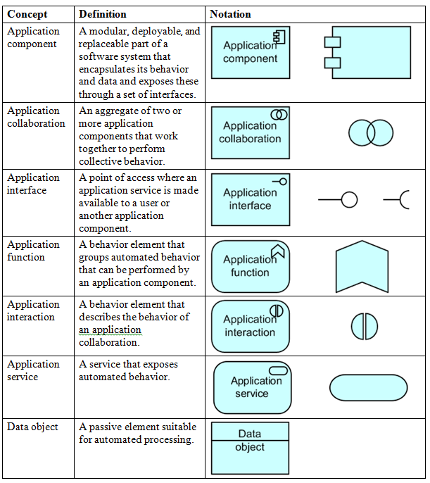

#Archinsurance Example - Application Layer

***According to opengroup.org, "the Application Layer supports the business layer with application services which are realised by (software) applications."***

##Application Layer - Legend of Possible Elements

##Applications and Data (user-defined sub folders)

Referring to the legend of elements above, review the elements created in the Applications and Data subfolders.

For more information on the Application Layer, please visit <http://pubs.opengroup.org/architecture/archimate2-doc/chap04.html>

