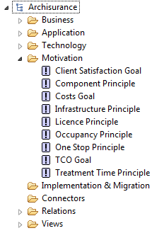

#Archinsurance Example - Motivation Extension

***According to opengroup.org, "a motivational element is defined as an element that provides the context or reason lying behind the architecture of an enterprise.  The Motivation extension of ArchiMate adds the motivational concepts such as goal, principle, and requirement. It addresses the way the enterprise architecture is aligned to its context, as described by motivational elements.***

##Motivation Extension - Legend of Possible Elements

##Motivation Folder

Referring to the legend of elements above, review the elements created in the Motivation folder.

For more information on Motivation, please see <http://pubs.opengroup.org/architecture/archimate2-doc/chap10.html#_Toc371945252>

