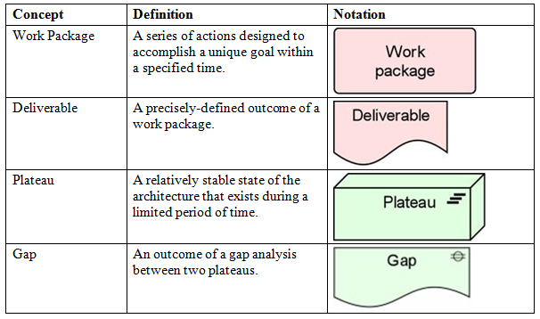

#Archinsurance Example - Implementation & Migration Extension

***According to opengroup.org, this extension adds concepts related to the implementation and migration of architectures.  This extension includes concepts for modeling implementation programs and projects to support program, portfolio, and project management, and a plateau concept to support migration planning.***

##Implementation & Migration Extension - Legend of Possible Elements

##Implementation & Migration Folder

Note that the Archinsurance example does not have any implementation on migration elements added to it.

For more information on Implementation and Migration, please see <http://pubs.opengroup.org/architecture/archimate2-doc/chap11.html>

