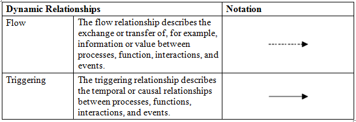
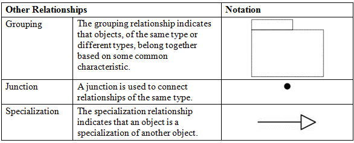

#Archinsurance Example - Relations

***Contains the relationships between elements as they are created in Views (diagrams) and any user-created sub-folders.***

##Classification of Relationships

Each element in the model can connect to one or more other elements via one or more relationships (connections).  These can be classified as either:

- Structural, which model the structural coherence of concepts of the same or different types.
- Dynamic, which are used to model (temporal) dependencies between behavioral concepts.
- Other, which do not fall in one of the two above categories.

##Relations Folder

Referring to the legend of elements above, review the elements created in the Relations folder:

For more information on relationships, please visit <http://pubs.opengroup.org/architecture/archimate2-doc/chap07.html#_Toc371945208>

