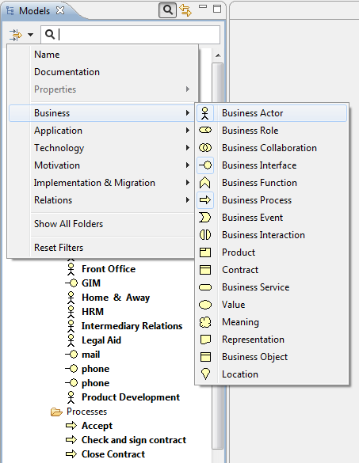

#Archi - some observations

Here are some useful observations from the **Archi User Guide** found in the **Help** area of Archi.

##Deleting an element

If an element that you wish to delete appears in one or more Views you will be warned that it is referenced in those Views. If you then delete the element from the tree you will also delete it from any Views where it is referenced.

##Adding New Elements to the View from the Palatte

If you add elements to a View from a palatte, they are automatically added to the appropriate type folder in your Model tree.

##Elements in italics

If an element in the Model Tree is in italic font, this indicates that it is not used in any View.

##Synchronising Selections in the Model Tree and a View

When selecting elements in the Model Tree and in diagram Views it is sometimes useful to synchronise the selection between the elements in both windows. Pressing the "Link to View" button in the Model Tree window allows this to happen:

##Filtering Element Types

To filter certain types of ArchiMate element you can select the different types to include in the filter/search in the drop-down menu:

