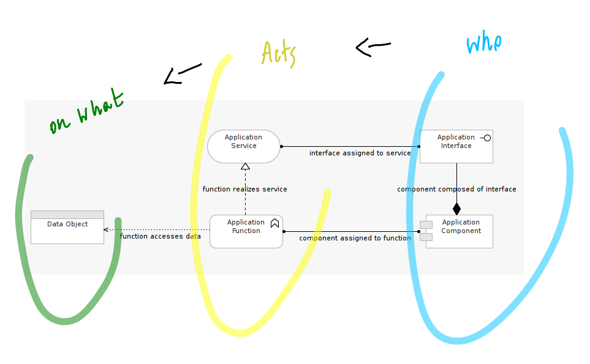
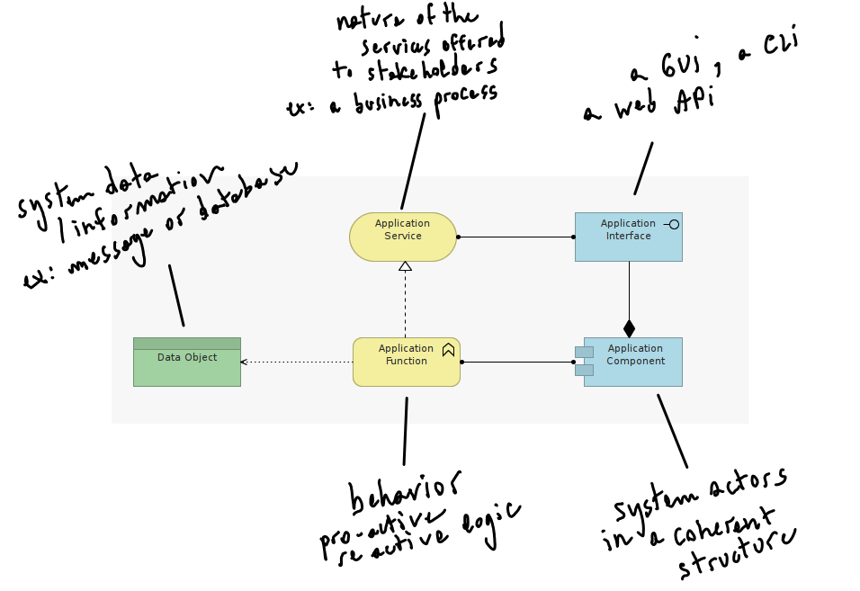

#Step 1

First let's compose a Basic Application template to describe what our application aims to achieve. 

Let's approach the problem in terms of "who acts on what": 
- (1.) its structure (who), 
- (2.) its behavior (acts on), and
- (3.) its data (on what).

To re-enforce the distinction between active (who) elements from behavioral (acting) elements, let's agree on some simple color conventions.

- Pastel green elements in the model will represent a passive data-at-rest source of information informing the behavior of the application.

- Pastel Blue elements in the model will represent the actors ('who') constituents of design structure.

- Pastel Yellow elements in the model will represent the behavioral aspects of the actors elements.

Here is the resulting template.

The two yellow and two blue elements in the image together make up the core of the application model, here grouped together in a grey rectangle.

Let's annotate the elements of our first model.

***Important note: You will notice that this proposed color-scheme doesn't mean the same as the color scheme proposed in the Archi IDE by default. In Archi, colors are mapped to Layers. In our case. we are mapping colors to element types. Both conventions are arbitrary, however ours will prove to be more meaningful as our models get complex.***

