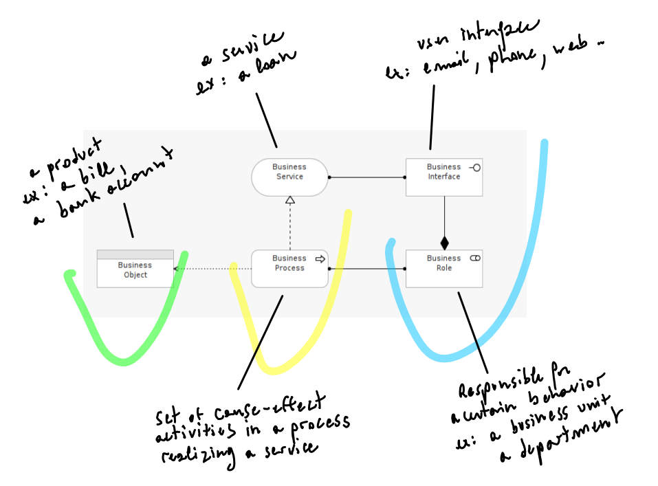
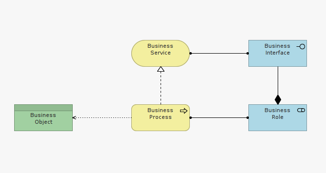

#Step 2

Second let's compose a Basic Business Process template to describe the way an application is used by its business users. 

Once again let's think in terms of "who acts on what": 

- (1.) its actors (who), 
- (2.) its process (acts on), 
- (3.) its resulting product/service (on what).

To re-enforce the distinction between active (who) elements from behavioral (acting) elements, let's apply our previously described color conventions.

##Exercise A

Consider the relationships between model elements in Figure 1e. Can you formulate the dependencies between these elements, taking inspiration from the labels of Figure 1a?

