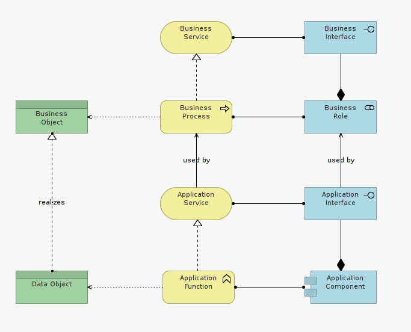

#Step 3

 Third, let's fill the missing links between business ant IT by mapping Application Structure with Business Structure, Application Behavior with Business Behavior, and Application Information with Business Product/Services.

Figure 1f demonstrates a basic template describing how IT (here a single enterprise application) offers supporting services to a business unit, in the context of a business process.

These templates are basic. In a real situation, As process(es) complexity and application(s) complexity increases, the principle exposed in figure 1f remains valid.

Any missing dependencies, any missing element, surfaced while mapping the application in its context of use outlines an architectural gap requiring attention.

