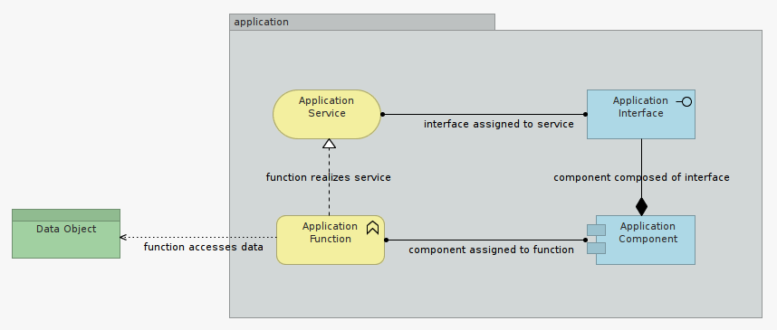

#Step 4

In this Step we will model the key constituent of a fictive application using the template described in Figure 1b, provided as a reminder below.

This application - a Web Portlet named DailyPhysicalRoutineAdvisor (DPRA) - will be quite small and simple.

DPRA aims to advise on what your daily physical routine should be, based on a number of factors, of which weight and size are strictly mandatory to start with.

The application is made of one single component, providing one simple Mobile Phone Interface to users, and relying on one persistent data source.

Based on the physiological parameters entered by its user, DPRA reaches to a data source - a decision table - to evaluate the daily exercise routine to prescribe as an output.

So, in essence, our application is a glorified calculator, nothing more. Its main component defines computations. Its function depends of the physiological parameters a user is willing to share. Its interface is a Mobile Application (Web, iOS or Android), and its service is... its very purpose: advising users on what their daily physical routine should be.

##Exercise B

Taking Figure 1b as reference, model DPRA application. 

Name model elements so these best reflect what they represent in relation to their element type. 

Use the NOTE element to annotate your first model and explain your design choices.

