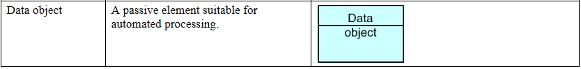

#LAB SETUP (Section A)
 
In SECTION A of this Lab, we will tailor our modeling environment to suit our needs and learn how to setup and trace architecture model elements.
 
##STEP A1 - SETTING UP MODELING CONVENTIONS
 
Archimate makes heavy use of color-schemes to help understanding models easily. The original specification however was color independent. Over the years, two types of color conventions have emerged:

- Color-scheme A: a primary - “Layer classification” - color scheme, and... 

- Color-scheme B: a secondary - “Actor classification” - color scheme. 
 
The Archimate Specification 2.1 is based on color-scheme [A], meaning:

- Yellow for model elements belonging to the Business Architecture Layer
- Blue for model elements belonging to the Application Architecture Layer
- Green for model elements belonging to the Infrastructure Layer
 
Archi's default configuration [http://www.archimatetool.com] is based on convention [A]. 

Below is an example of the "layer based" color-scheme in Archi:
 

While color-scheme [A] is a perfectly valid color-scheme, experienced architects prefer using color- scheme [B], meaning:

- Blue for ACTIVE model elements,  
- Yellow for BEHAVIORAL model elements, and 
- Green for PASSIVE model elements. 
 
We have introduced this color-scheme in our previous Lab (Lab 1). Go back to Lab 1 to remember what 'active', 'behavioral' and 'passive' mean.
 
The first thing we will do to setup this second Lab is to configure our Modeling Environment to reflect the conventions defined in Lab 1.
 

###EXERCISE 1

- Download the new stencils from Moodle onto your computer drive from this link 

- [ColorScheme_B.prefs](./archives/ColorScheme_B.prefs)

- Start Archi if not done already

- Go in "Edit" > "Preferences", then select "Colors and Fonts" from the preferences list on the left:

- Click on "Import Scheme" (to the right of the dialog box)

- Select the .prefs file you have downloaded from Moodle

- Make sure you tick the check-box named: "Save the default colors for elements in the model file"

- Make sure you also tick the check box named "Use these fill colors in the model tree and editor palette"

- Click OK

- Close and Restart Archi
 
Let's verify that our new color-scheme has been uploaded:
 
- Start Archi once gain, unless done already

- Go in "Edit" > "Preferences", then select "Colors and Fonts"

- Expand the "Application element fill colors"
 
We can see our new color-scheme has been applied.

You will notice changes in the Palette. The model elements in the Palette have changed from the old color-scheme [A], to the new color-scheme [B].

Let's verify our new stencils work correctly:

- Look for a "Data Object" model element from the palette. The Archimate 2.1 specification describes the Data Object element as follows:

- Since this is a PASSIVE model element, we should see it displayed in green in our newly updated palette:

- Select the "Data Object" element, and drag it on a new model canvas. You should see the model element successfully dropped on the canvas... this time, in green.

###EXERCISE 2

Color-scheme [B] uses color tones to distinguish ELEMENT TYPES (as opposed to the default color-scheme, distinguishing LAYER TYPES). Color-scheme [B] also represents what Layer modeling elements belong to, using color shades.
 
- Create a new blank model in Archi

- Clone the figure below

- Can you read from this model the stories of Who, Acts on, What, How and When?

###Discussion on Modelling Conventions
 
In the figure above, Business layer modeling elements (top) are represented by light shades blue/yellow/green colors, while elements of the Infrastructure layer are represented by deeper colors (bottom).
 
The more complicated the model, the more important it is to use an unambiguous modeling convention... in this case choosing a good color scheme much more than a matter of aesthetics. It helps reading / instant understanding.
 
In Enterprise environments, many modeling conventions (other than color schemes alone) are agreed upon. Some conventions constrain the use of some modeling elements; others specify a naming rules for model elements, and/or modeling views.
 
For the purposes of this Lab, we will not introduce any more modeling conventions.
 
##STEP A2 – TREE MODEL INVENTORY
 
Architects like to build libraries of re-usable model elements. Overtime, this strategy pays off because it becomes possible to RE-USE elements previously created, and benefit from existing documented attributes, properties defined for each (as opposed to re-creating the same model elements from scratch over and over).
 
From a new blank model, create a 2 application components part of Runkeeper.com's IT landscape.
 

###EXERCISE 3

- Click-right on the “Application“ folder in the Model Tree, then “New” > “Application Component”.

- Create 2 new model elements of type “Application Component”. Name each respective element as follows: 

- “Fitness Tracking App”

- “Fitness Tracking Web”

You will notice that the two new model elements are displayed in italic. Why? Because none are included into a graphical Model Canvas yet. Let's create a new blank canvas view, and drag each element onto it.

 
Now let's look back at our Model Tree. We can see that each model element isn't in italic any longer.

###EXERCISE 4 

- In the Model Tree panel, let's change the name of each model element:

    - From “Fitness Tracking App” to → “Fitness App”

    - From “Fitness Tracking Web” to → “Fitness Web”

...notice how the model elements on your Model Canvas are immediately updated to reflect the changes you have performed in the Model Tree.

###DISCUSSION PN MODEL TREE
 
A Model Tree stores the library re-usable Architecture model elements. It allows you to create model elements once and use them across many diagrams. You can update the attributes of the element once in the Model Tree, and changes will get reflected in all diagrams at once.
 
Furthermore, the Visualize panel provides insight on the relationships between model elements.

Using the Visualizer, an architect can browse all Elements from an architecture library using a graph browser, scanning through (n) levels of depth.

A Model Graph Visualizer is much more than a fancy widget. It is a very important way for architects to control the TRACEABILITY of their architecture. For example, starting from a Validation Component underpinning a Web Form, we can trace up to the Feature is implements, the Capability it realizes, all the way up to the Goal it helps to achieve.

In conclusion, we have seen that an architecture library of model elements can be setup independently from creating any Model Canvas. Knowing this, during the course of the next few Labs, we will incrementally add new elements into our architecture library, then find & re-use (drag-and-drop) these elements to model the Views of Runkeeper's Advanced Analytics Dashboard solution architecture.
 