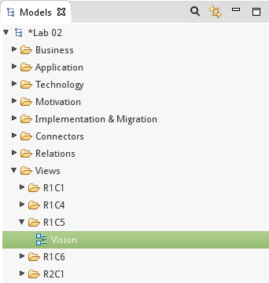
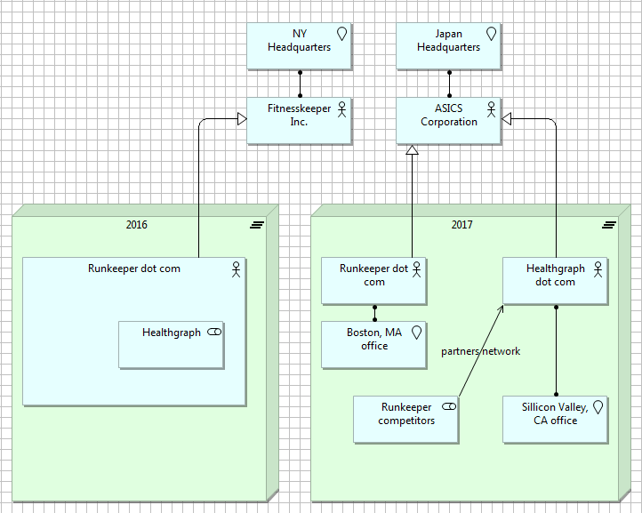
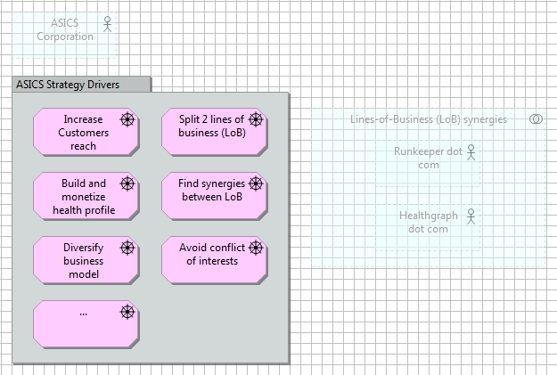
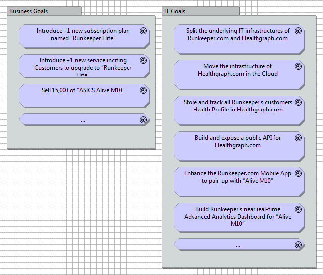

#SCOPE IDENTIFICATION: MODEL PRIMITIVES (SECTION B)
 
In SECTION B of this Lab, we are introducing Runkeeper’s business context. The high-level contextual analysis we are about to embark on will provide you with the knowledge you need to model a solution architecture for a new Advanced Analytics Dashboard, …and enough room to base your own subject assignment on Runkeeper.com (if you wish to do so).
 

##STEP B1 - VISION & DRIVERS
 
In January 2016, “Runkeeper.com” (http://runkeeper.com) is a subsidiary company of Fitnesskeeper Inc.

“Healthgraph” (https://runkeeper.com/developer/healthgraph/), is an internal division of Runkeeper.com.
 
In February 2016, Fitnesskeeeper has entered into a definitive agreement to be purchased by ASICS Corporation.
Headquartered in Japan, ASICS is best-known for making running shoes and clothing, but also has its own training app for runners.
The combined companies will work on physical products with digital fitness tracking features.
 
Runkeeper.com will continue to exist as a standalone offer, from the Customer standpoint, not much will change.
However, starting in 2016 and over the next 2 to 3 years, the management board plans to split Healthgraph from Runkeeper.com, to create a new subsidiary company named Healthgraph.com.
Doing so will make of Healthgraph.com a new business line of ASICS Corporation, independent from Runkeeper.com.
 
IT projects are tools to execute on a strategy. So first, let's capture the main constituents of the Management Board’s vision.
To do so, we'll use an analytical framework as described in Lecture Group #1, Part 5.
 

 

###EXERCISE 5

- In the Model Tree, under the View folder, create a new sub-folder named: “R1C5 – Strategy increments”

- Within the folder newly added above, create a new Model canvas named “Vision”

- In your Model Tree add the model elements you see in the figure below

- Then drag the elements you have created on a new canvas and clone the figure below

###MORE VISION & DRIVERS 

In 2016, Runkeeper.com's focus will be to reach out to a wider audience via an increasing range of health and activity tracking devices manufactured by ASICS. Runkeeper.com will aim to invest in new ways of capturing health data points using the explosion of fitness-tracking technologies (e.g. via wearable devices coupled to phones, via improved phone motion co-processors, etc.). 
 
Healthgraph.com will aim to invest in ways to enrich its database of personal health profiles beyond the list of Runkeeper’s customers only. The objective is to have more data points available to better match and correlate activities, body measurements, and nutrition data.
 
Being independent from Runkeeper.com, it is expected that Healthgraph.com will create partnerships with competitors of Runkeeper. Competitors to Runkeeper are: GymPact (http://www.gym-pact.com/), Caledos Runner (http://api.caledos.com/), TomTom MySports (http://mysports.tomtom.com/).
 
Ultimately, it is expected that ASICS Corporation will benefit from the synergies between Healthgraph.com and Runkeeper.com (for example, gain in accuracy of training, coaching, diet recommendations via advance data analytics & reporting).
 
###EXERCISE 6

- In the Model Tree, under the View folder, create a new sub-folder named: “R1C6 - Mandate / Intent & directives”

- Within the folder newly added above, add the model elements you see from the “DRIVERS” bullet list in the paragraph below
DRIVERS:

    - Increase Customers reach
    - Split into 2 lines of business (LoB)
    - Build and Monetize health profiles
    - Find synergies between LoB
    - Diversify business model
    - Avoid conflict of interests (between Runkeeper and Healthgraph)

- Within the folder newly added above, create a new Model canvas named “List of Drivers”

- Then drag the elements you have created on a new canvas and clone the figure below
 

##STEP B2 – ENVIRONMENTAL CONSTRAINTS
 
You have been contracted by the CIO of Fitnesskeeper Inc as the main Solution Architect for proposing how to split Healthgraph from Runkeeper.com over the next 2 years. As part of your overarching assignment, your job is to design  a new dashboarding capability for Runkeeper.com. This new capability - referred as “Advanced Analytics Dashboard”- will heavily rely on Healthgraph. This dashboard will be the first foray into successfully leveraging the API services of Healthgraph.com.
 

###EXERCISE 7

- In the Model Tree, under the View folder, create a new sub-folder named: “R1C4 - Influencers / Environment constraints”

- Withing the folder newly added above, create a new Model canvas named “List of Stakeholders”

- In your Model Tree add the model elements you see in the figure below

- Then drag the elements you have created on a new canvas and clone the figure below
 

 

###EXERCISE 8

- In the Model Tree, under the R1C4 folder, create a new Model canvas named “List of key Constraints”

- In your Model Tree add the model elements you see from the “CONSTRAINTS” bullet list in the below paragraph:
 CONSTRAINTS:

    - The “Advanced Analytics Dashboard” only displays data pertaining to activity & health metrics captured by the “ASICS Alive M10” device.

    - Activity & health profile metrics are received from the “ASICS Alive M10” device ONLY via Runkeeper.com App.

    - Activity & health profile metrics cannot be tempered with.

    - Activity & health profile metrics are strictly private and cannot be disclosed without consent.

- Optional: Drag the elements you have created on the newly created canvas

 
##STEP B3 – OBJECTIVES
 
In this step we will introduce a number of fictive goals to illustrate motivation modeling.
 
- BUSINESS Goals:

    - Dissociate Healthgraph from Runkeeper.com 
    - Introduce +1 new subscription plan named “Runkeeper ELITE”. 
    - Convert 20% of Runkeeper's invoiced customer base to the next-level subscription plan. 
    - Increase Runkeeper's number of registered, paying Customers by 50%. 
    - Sell 15,000, units of “ASICS Alive M10”. 
    - Introduce +1 new service offer bound with this new device, inciting Customers to upgrade to “Runkeeper ELITE”. 
    - Create the first +2 partnerships of Healthgraph.com with direct competitors of Runkeeper.com. 
    - Increase the size of Healthgraph.com's database/network by 10%. 
 
- IT Goals:

    - Split the underlying IT infrastructures of Runkeeper.com and Healthgraph.com. 
    - Move the infrastructure of Healthgraph.com in the Cloud. 
    - Build and expose a public API for Healthgraph.com, delivering data services for storing/retrieving customer profile data. 
    - Store and track all Runkeeper's customers Health Profile in Healthgraph.com. 
    - Enhance the Runkeeper.com Mobile App to pair-up with the new “Alive M10” wearable commercialized on Runkeeper Store. 
    - Build an Advanced Analytics Dashboard visualizing the metrics captured by the “Alive M10” wearable device in near real-time. 
 
EXERCISE:
→ In the Model Tree, under the R1C6 folder, create a new Model canvas named “List of Goals”
→ In your Model Tree add the model elements you see in the figure below
→ Then drag the elements you have created on a new canvas and clone the figure below
  

###EXERCISE 9

- In the Model Tree, under the R1C6 folder, create a new Model canvas named “List of Principles”

- In your Model Tree add the model elements you see from the “PRINCIPLES” bullet list in the paragraph below

- PRINCIPLES:

    - Principle 1: Customers pay for results”.
    - Principle 2: Confidentiality about Health profiles is paramount.

- Optional: Drag the elements you have created on the newly created canvas

