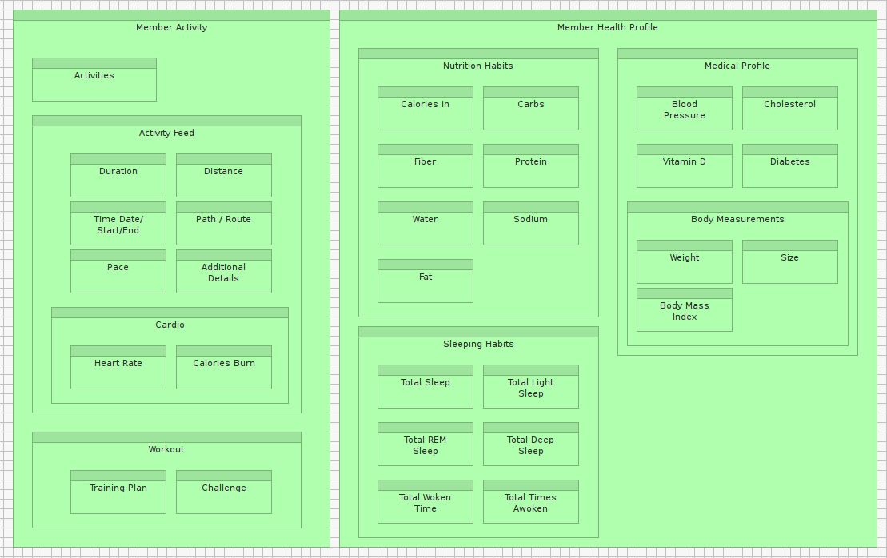
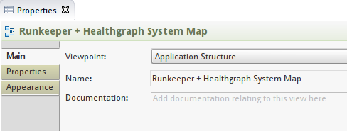
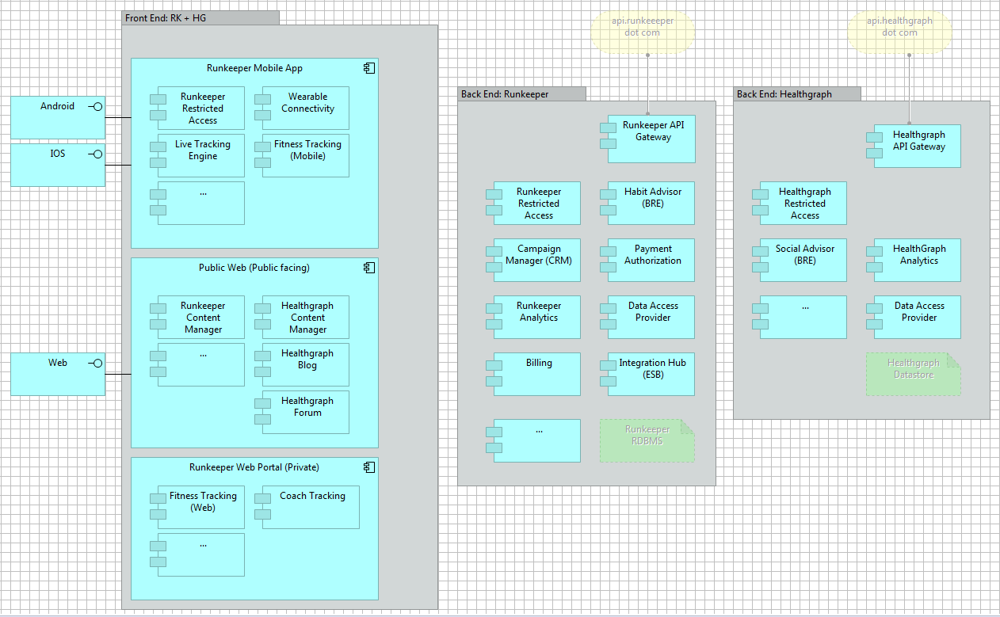

#INVENTORY SETS: MODEL PRIMITIVES (SECTION C)
 
In SECTION C of this Lab, we'll build a few Inventory Sets that we can leverage later when creating Solution Architecture Views for the Advanced Analytics Dashboard.  We will intentionally limit ourselves to the creation of 3 primitive models: 

- Runkeeper capabilities/functions (R1C1) 
- Runkeeper data classes + front-end and back-end components (R3C1) 
- Runkeeper infrastructure (R6C1) 
 

##STEP C1– CAPABILITY MAP

 
##EXERCISE 10

- In the Model Tree, under the View folder, create a new sub-folder named: “R1C1 –  Business capabilities / functions”

- Within the folder newly added above, create a new Model canvas named “Runkeeper Capability Map”

- In your Model Tree add the model elements you see in the figure below
 
- Then drag the elements you have created on a new canvas

 

- Set the Viewpoint type for this newly created Canvas to “Business Function” in the Properties panel

- Clone the figure below

 
##STEP C2– DATA MAP / SYSTEM MAP

 
###EXERCISE 11

- In the Model Tree, under the View folder, create a new sub-folder named: “R3C1 –  System / Data Assets”

- Within the folder newly added above, create a new Model canvas named “Runkeeper Data Map”

- Set the Viewpoint type for this newly created Canvas to “Information Structure” in the Properties panel

- Clone the figure below

- Within the same folder create a new Model canvas named “Runkeeper + Healthgraph System Map”

- Set the Viewpoint type for this newly created Canvas to “Application Structure” in the Properties panel

 

- Clone the figure below

##STEP C3– INFRASTRUCTUREMAP
 
###EXERCISE 12

- In the Model Tree, under the View folder, create a new sub-folder named: “R6C1 –  Infrastructure”

- Within the folder newly added above, create a new Model canvas named “Runkeeper  + Healthgraph Infrastructure Map”

- Set the Viewpoint type for this newly created Canvas to “Infrastructure Usage” in the Properties panel

- Clone the figure below

