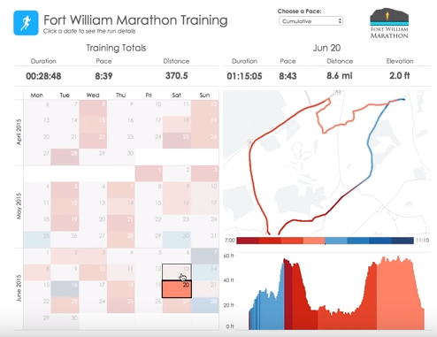

#LAB INTRODUCTION (Section D)

The figure below present the outlay of the Web Desktop version of the new Runkeeper.com “Achiever Analytics Dashboard”, reserved to ELITE members only.
 
 
 

The dashboard is composed of 4 main areas:
 
- Area 1 (Left): An interface to select the dates of Activities you wish to run Analytics on
- Area 2 (Top): The summary banner of key data indicators describing Key Performance Indicators (KPIs), based on selected dates,
- Area 3 (Top-Right): A terrain topology overlay of all activities performed, based on selected dates,
- Area 4 (Bottom-Right): A graph showing the variations of a specific data point (here elevation, but it could be heart beat, steps, etc.) over the total duration of all selected activities.

##Note 1
The dashboard above present data pertaining to Running Activities only.
Dashboard contents and graphics for other activities may slightly vary, but the principle remains the same.
 
##Note 2
**Red** means a decrease in pace.
**Blue** means in increase in pace.

To describe the design of the Analytics Dashboard, we limit ourselves to the creation of the following Architecture Views:
 
- In Section D.0 Context View 
- In Section D.1 Behavioral View 
- In Section D.2 Information View 
- In Section D.3 Functional View 

##Note 3
The two most important decisions made about the Architecture we will describe in the next section are:

1.***Performance by Design***: an asynchronous batch analytics daemon continuously runs on Runkeeper's servers to perform the most data intensive calculations and prepare De-normalized data analytics views that the Dashboard can connect to 

2.***Data Source Abstraction***:  data from multiple sources (off-premise, and on-premise) is consolidated in one location), accessed through an indirection layer reducing coupling between front-end and back-end. 

