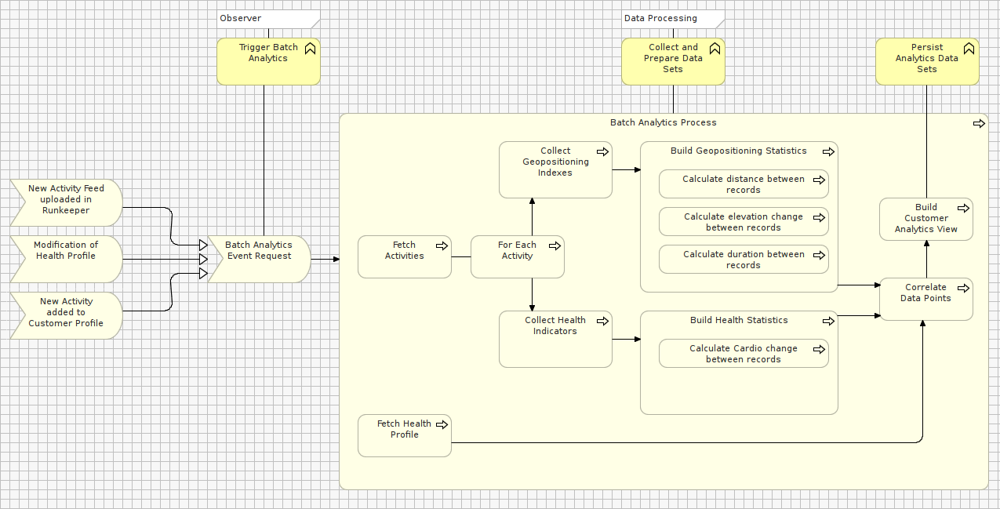

#STEP D1 – Creating the BEHAVIORAL VIEW

The purpose of this View is to outline:

1. How data gets collected and prepared for purposes building analytics data sets 
2. How analytics data sets are served to users 
 

###D1a: DATA PREPARATION

A Data Preparation process is triggered every time a User uploads new data points (e.g. a new activity feed, a modification of heath profile).
The result of the data preparation stores User Analytics Views into Runkeeper's Data Warehouse.

 
###EXERCISE

- In the Model Tree, under the View folder, create a new sub-folder named: “D - Analytics Dashboard”

- In the Model Tree, under the View folder, create a new sub-folder named: “D1 - Behavioral View”

- Within the folder newly added above, create a new Model canvas named “D1a – Data Preparation”

- Clone the figure below

 
###D1b: DASHBOARD RENDERING
 
To display render data analytics related to a set of selected dates, a number of reporting objects are generated from Runkeeper's Data Warehouse.

The Data Warehouse stores all essential analytics data points required to fulfill analytics requests of all ELITE members.

 
###EXERCISE
 
- In the Model Tree, under the View folder, create a new sub-folder named: “D - Analytics Dashboard”

- In the Model Tree, under the View folder, create a new sub-folder named: “D1 - Behavioral View”

- Within the folder newly added above, create a new Model canvas named “D1b – Dashboard Rendering”

- Clone the figure below

