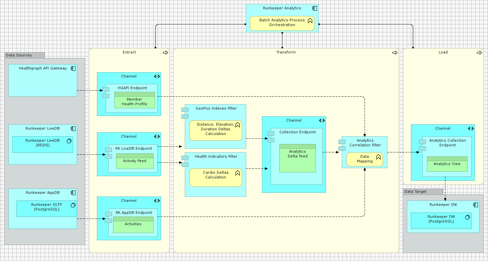
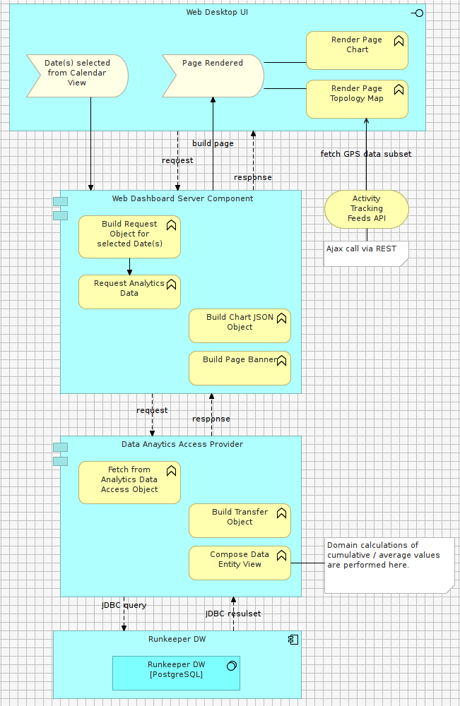

#STEP D2 – Creating the INFORMATION VIEW

The purpose of this View is to model:

1. Data flow of the asynchronous Batch Analytics data preparation process 
2. Data flow of the synchronous request/response dashboard rendering process 
 
**Selected Data-driven Architectural Style**: Data Warehousing ETL

**Selected Architectural Patterns**: Pipes & Filters, Batch Data Processing

 
###EXERCISE

- In the Model Tree, under the View folder, create a new sub-folder named: “D - Analytics Dashboard”

- In the Model Tree, under the View folder, create a new sub-folder named: “D2 - Information View”

- Within the folder newly added above, create a new Model canvas named “D2a – Batch Analytics Data Flow”

- Clone the figure below

 
###EXERCISE
 
- In the Model Tree, under the View folder, create a new sub-folder named: “D - Analytics Dashboard”

- In the Model Tree, under the View folder, create a new sub-folder named: “D2 - Information View”

- Within the folder newly added above, create a new Model canvas named “D2b – Dashboard Rendering Data Flow”

- Clone the figure below

