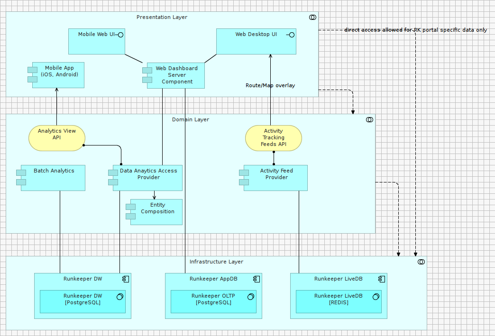
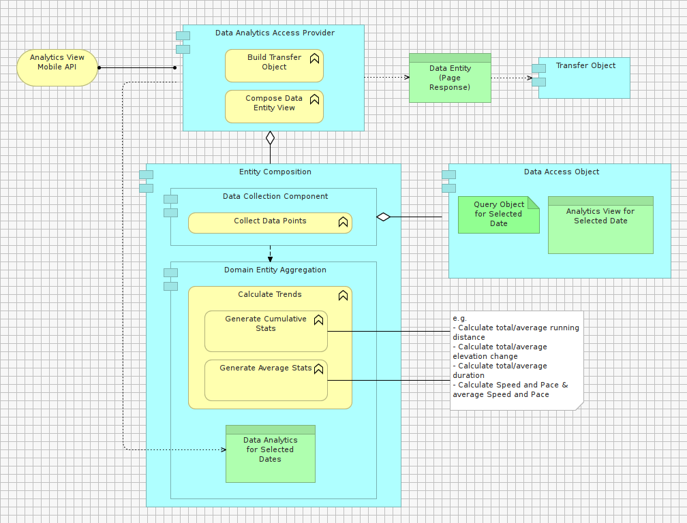

#STEP D3 – Creating the FUNCTIONAL VIEW(S) of our Analytics Dashboard

The purpose of this View is to outline:

1. The structure of our design and grouping of key components 
2. How presentation components are abstracted data sources 
 
***Selected Application-driven Architectural Style***: Layered Architecture – Relaxed Layering Variant.

***Selected Architectural Patterns***: Transfer Object, DAO (Data Access Object), Template View (MVC), Entity Aggregation.

 
###EXERCISE

- In the Model Tree, under the View folder, create a new sub-folder named: “D - Analytics Dashboard”

- In the Model Tree, under the View folder, create a new sub-folder named: “D2 - Functional View”

- Within the folder newly added above, create a new Model canvas named “D3a – Indirection Layers””

- Clone the figure below

 
###EXERCISE
 
- In the Model Tree, under the View folder, create a new sub-folder named: “D - Analytics Dashboard”

- In the Model Tree, under the View folder, create a new sub-folder named: “D3 - Functional View”

- Within the folder newly added above, create a new Model canvas named “D3b – Data Provisioning”

- Clone the figure below

