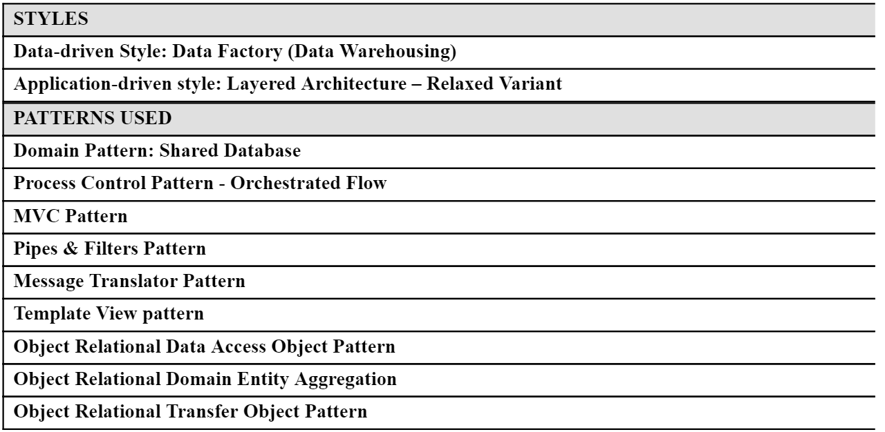

#LAB INTRODUCTION (Section E)

In the past Labs we have created a number of Architectural Artifacts. IT Architects are expected to submit their Architecture for review and Stakeholder approval. In the same way IT Architects do, you will therefore have to submit your work assignment deliverable in the form of a single, all encompassing, Architecture Description document deliverable.
 
In SECTION E of this Lab, for example purposes, we will build the Architecture Description for Runkeeper’s Achiever Analytics Dashboard solution.  We will compose some of the Architectural Artifacts created in previous Labs into a single container document – i.e. an Architecture Description deliverable.
 
To achieve this, we will work from the Architecture Description document template provided by the TOGAF 9.1 Architecture Framework:

- [TOGAF 9.1 AD Template PDF](./archives/TOGAF 9.1 AD.pdf) 

- [TOGAF 9.1 AD Template ODT](./archives/TOGAF 9.1 AD.odt) 

 
 

##STEP E1

As we are starting our first deliverable, we will first focus on enumerating the View Models, Patterns, Styles and annotate the rationale behind our decisions.

i.e. select the following Architecture Views:

 

...and list the Architecture Styles & Patterns we will leverage, keeping in mind that we’ll need to explain the rationale behind their selection, and how these link to Views:

 

##STEP E2

We will address the Required Quality Attributes of the architecture with Perspectives,
and for each, record decisions and trade-offs we made.

This is something we haven’t yet worked in our Labs, but is an important aspect of our architecture,
so let’s take the time to  document the required quality properties of our solution:

##STEP E3

Lastly, it is important to spend some time to capture elements of the problem space that give some essential context to the Architecture we put forward, and articulate a few key assumptions for Stakeholders to confirm:

###EXERCISE:

- Download the TOGAF AD 9.1 Template provided 

    - [TOGAF 9.1 AD Template ODT](./archives/TOGAF 9.1 AD.odt)

- Based on the descriptions provided above, fill-out the PROBLEM SCOPE section (Section A.1) of the AD Template

- Based on the descriptions provided above, fill-out the REQUIRED QUALITY PROPERTIES section (Section A.3) of the AD Template

- Based on the descriptions provided above, fill-out the ARCHITECTURE VIEWS section (Section B.1) of the AD Template

**Note: The resulting output / solution can be found here:**

- [TOGAF 9.1 AD RunKeeper Solution ODT](./archives/TOGAF 9.1 AD - RK.odt) 
- [TOGAF 9.1 AD RunKeeper Solution DOCX](./archives/TOGAF 9.1 AD - RK.docx)
- [TOGAF 9.1 AD RunKeeper Solution PDF](./archives/TOGAF 9.1 AD - RK.pdf)

