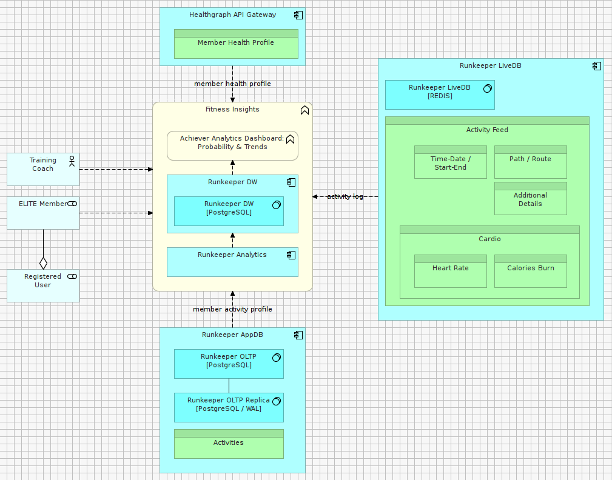

#SECTION E4. – DOCUMENTING VIEWS

##Step E.4.1

In order to describe the Context View of of Architecture Solution, we select two types MODEL PRIMITIVES, each based on a specific VIEW TYPE:
 

The SYSTEM CONTEXT MODEL describing part of our CONTEXT VIEW is described as follows:

The corresponding model artifact, created in a previous Lab greatly benefits from the descriptions above,
(typically during an architecture review):

###EXERCISE

- Based on the descriptions provided above, fill-out the VIEW INTENT section (Section B.2.1) of the AD Template

- Based on the descriptions provided above, fill-out the VIEW MODELLING ARTIFACTS section (Section B.2.2) of the AD Template

**Note: The resulting output / solution can be found here:**

- [TOGAF 9.1 AD RunKeeper Solution ODT](./archives/TOGAF 9.1 AD - RK.odt) 
- [TOGAF 9.1 AD RunKeeper Solution DOCX](./archives/TOGAF 9.1 AD - RK.docx)
- [TOGAF 9.1 AD RunKeeper Solution PDF](./archives/TOGAF 9.1 AD - RK.pdf)

##Step E.4.2

The SYSTEM FEATURES MODEL describing part of our CONTEXT VIEW is described as follows:

The following model artifact, created in a previous Lab, can then be reviewed:

###EXERCISE

- Based on the descriptions provided above, fill-out the VIEW MODELLING ARTIFACTS section (Section B.2.2) of the AD Template.

**Note: The resulting output / solution can be found here:**

- [TOGAF 9.1 AD RunKeeper Solution ODT](./archives/TOGAF 9.1 AD - RK.odt) 
- [TOGAF 9.1 AD RunKeeper Solution DOCX](./archives/TOGAF 9.1 AD - RK.docx)
- [TOGAF 9.1 AD RunKeeper Solution PDF](./archives/TOGAF 9.1 AD - RK.pdf)

##Step E.4.3

In the same way we have document the Context View of our Architecture in the section above,
other Views can be generated using the same structure.

###EXERCISE

- Complete Sections B of the AD Template using the following model artifacts created in previous Labs:

- For each, try to justify the use of Model Kind, Patterns and Styles leveraged to model the View

**Note: The resulting output / solution can be found here:**

- [TOGAF 9.1 AD RunKeeper Solution ODT](./archives/TOGAF 9.1 AD - RK.odt) 
- [TOGAF 9.1 AD RunKeeper Solution DOCX](./archives/TOGAF 9.1 AD - RK.docx)
- [TOGAF 9.1 AD RunKeeper Solution PDF](./archives/TOGAF 9.1 AD - RK.pdf)

