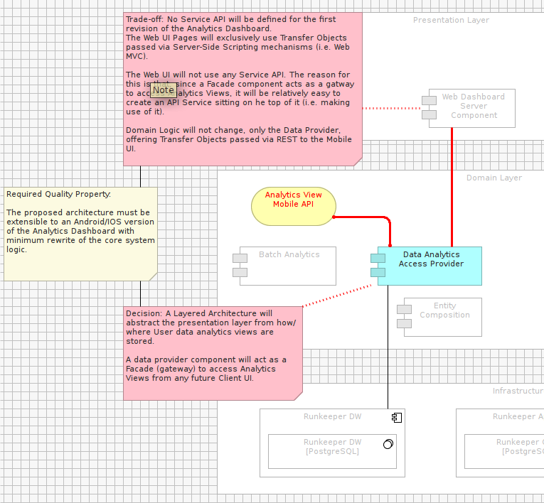
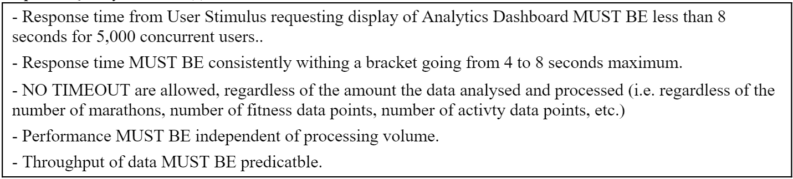
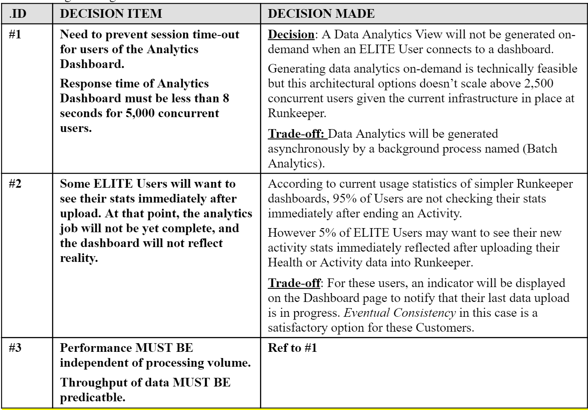
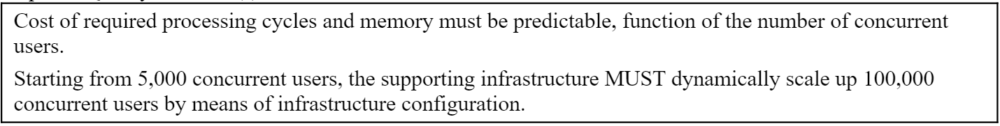
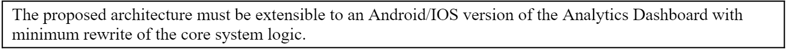

#SECTION E5. – DOCUMENTING PERSPECTIVES

We need to address the Required Quality Attributes of the architecture with Perspectives,  and for each, record decisions and trade-offs we made.

For this Lab, we will prefer answering required quality attributes preferring textual description over visual models. There is not good reason for this; it is perfectly acceptable to annotate existing Archimate models with colors, legends and comments to document Perspectives.

For example: A description of the Flexibility/Maintainability Perspective of our Analytics Dashboard.

However, the most common practice in the industry remains structured textual contents.

As a result, and for the purposes of this Lab, what follows prefers a textual description over modeling.

##Step E.5.1: Performance Perspective

Required Quality Attribute(s):

- Recording of design decisions and trade-offs:

###EXERCISE

- Fill-out the PERFORMANCE PERSPECTIVE section (Section B.6.1) of the AD Template, using textual descriptions proposed above.

- Reflexion point: Imagine what models you would annotate if you had to represent your Perspectives using visual models (hence keeping traceability of architectural decisions version-controlled in the same framework as the rest of your model artifacts).

- Reflexion point: Since the Quality Properties of an Architecture (like Performance) permeate across many Views of a solution design, would generating a Mapping of existing Views into one Model help your annotation efforts?

**Note: The resulting output / solution can be found here:**

- [TOGAF 9.1 AD RunKeeper Solution ODT](./archives/TOGAF 9.1 AD - RK.odt) 
- [TOGAF 9.1 AD RunKeeper Solution DOCX](./archives/TOGAF 9.1 AD - RK.docx)
- [TOGAF 9.1 AD RunKeeper Solution PDF](./archives/TOGAF 9.1 AD - RK.pdf)

##Step E.5.2: Scalability Perspective

Required Quality Attribute(s):

- Recording of design decisions and trade-offs:

###EXERCISE

- Fill-out the SCALABILITY PERSPECTIVE section (Section B.6.2) of the AD Template, using textual descriptions proposed above.

**Note: The resulting output / solution can be found here:**

- [TOGAF 9.1 AD RunKeeper Solution ODT](./archives/TOGAF 9.1 AD - RK.odt) 
- [TOGAF 9.1 AD RunKeeper Solution DOCX](./archives/TOGAF 9.1 AD - RK.docx)
- [TOGAF 9.1 AD RunKeeper Solution PDF](./archives/TOGAF 9.1 AD - RK.pdf)

##Step E.5.3: Testability Perspective

Required Quality Attribute(s):

- Recording of design decisions and trade-offs:

###EXERCISE

- Fill-out the TESTABILITY PERSPECTIVE section (Section B.6.3) of the AD Template, using textual descriptions proposed above.

**Note: The resulting output / solution can be found here:**

- [TOGAF 9.1 AD RunKeeper Solution ODT](./archives/TOGAF 9.1 AD - RK.odt) 
- [TOGAF 9.1 AD RunKeeper Solution DOCX](./archives/TOGAF 9.1 AD - RK.docx)
- [TOGAF 9.1 AD RunKeeper Solution PDF](./archives/TOGAF 9.1 AD - RK.pdf)

##Step E.5.4: Flexibility Perspective

Required Quality Attribute(s):

- Recording of design decisions and trade-offs:

###EXERCISE

- Fill-out the FLEXIBILITY PERSPECTIVE section (Section B.6.4) of the AD Template, using textual descriptions proposed above.

**Note: The resulting output / solution can be found here:**

- [TOGAF 9.1 AD RunKeeper Solution ODT](./archives/TOGAF 9.1 AD - RK.odt) 
- [TOGAF 9.1 AD RunKeeper Solution DOCX](./archives/TOGAF 9.1 AD - RK.docx)
- [TOGAF 9.1 AD RunKeeper Solution PDF](./archives/TOGAF 9.1 AD - RK.pdf)

